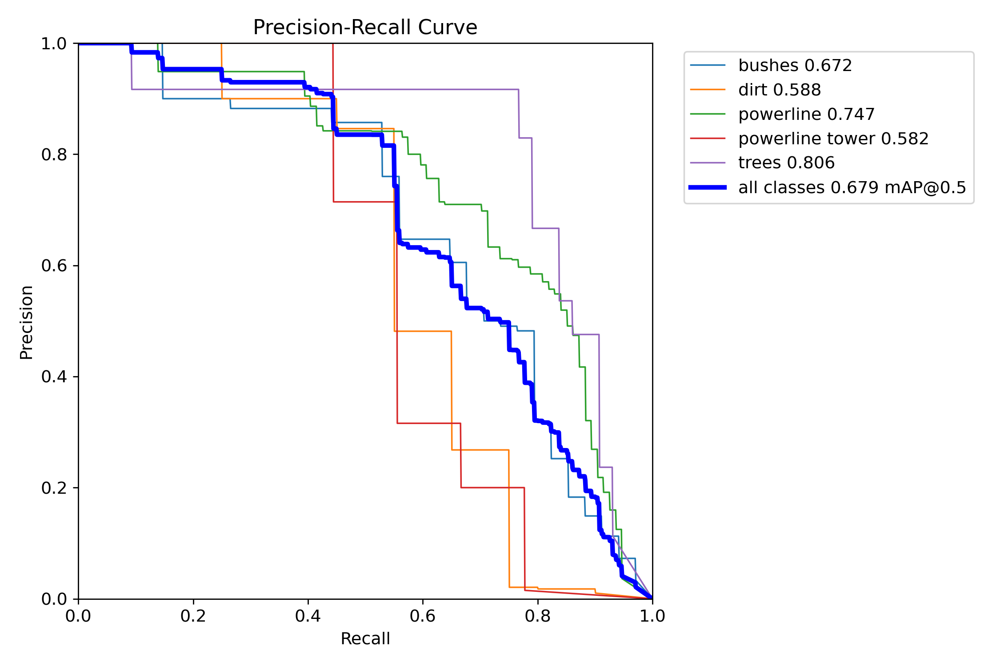
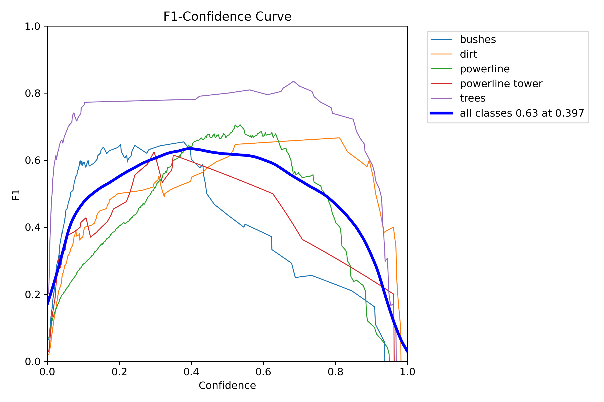
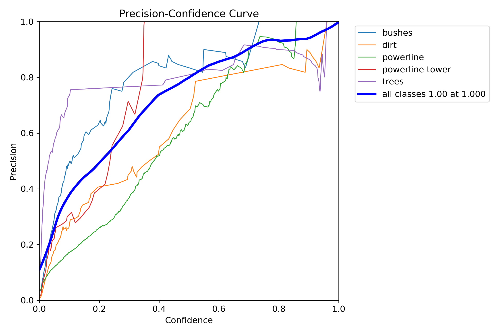
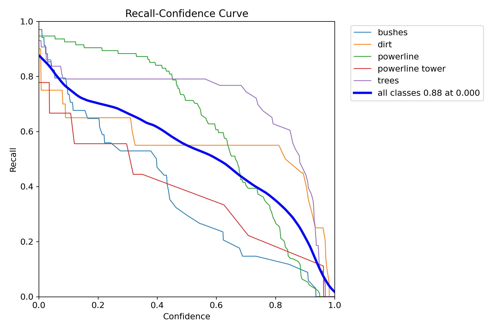
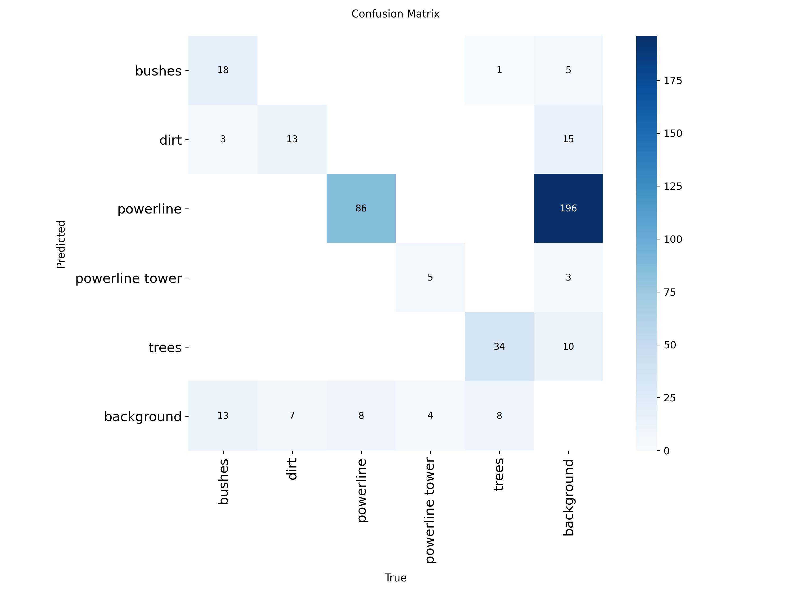
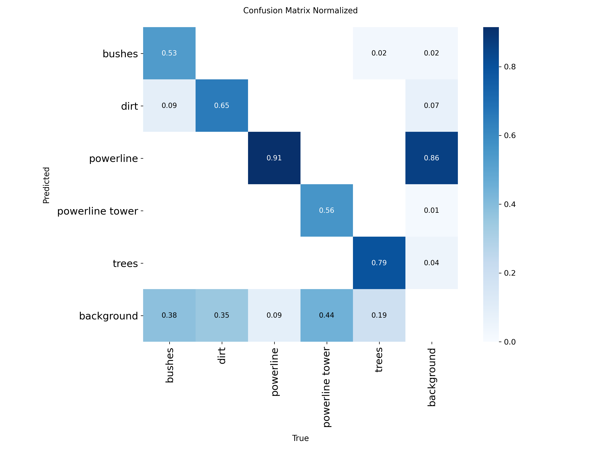
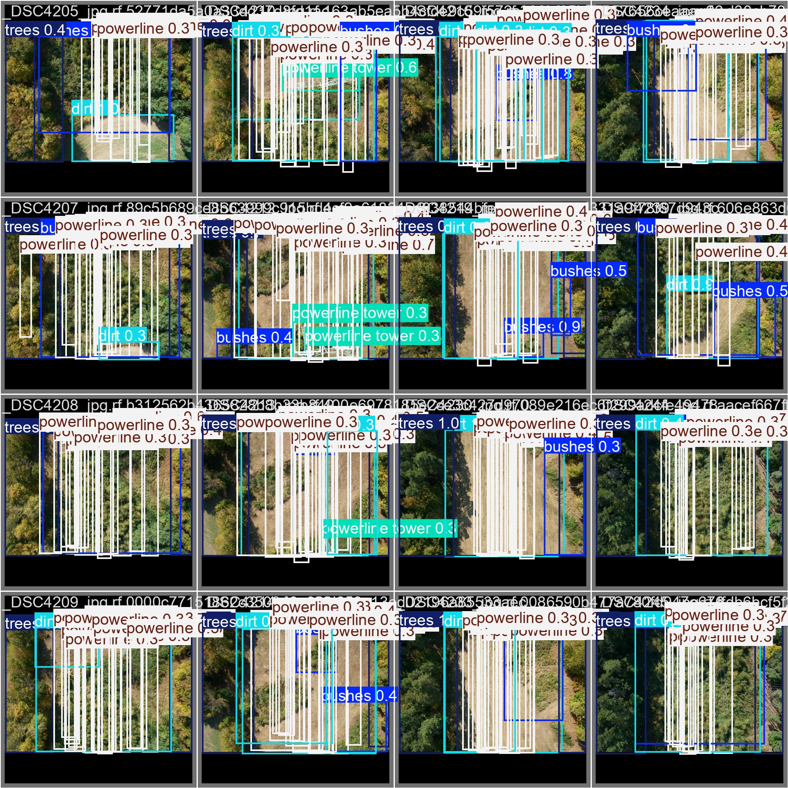

# Report

Questo lavoro di tesi affronta l'analisi dei rischi in prossimità delle linee elettriche ad alta tensione, utilizzando immagini aeree acquisite da droni. L'intera metodologia si fonda sull'applicazione di Computer Vision e Machine Learning per automatizzare il rilevamento dei pericoli.
Il percorso della tesi segue due approcci principali. Inizialmente, vengono esplorate tecniche di Computer Vision tradizionali, come l'edge detection, per identificare i cavi elettrici in contesti complessi come quelli boschivi; questa sezione include un'analisi delle matrici e dei filtri utilizzati e i risultati conseguiti.
Successivamente, il focus si sposta su una pipeline di Object Detection. Questa parte inizia con una disamina approfondita dei dataset impiegati per l'addestramento, definendone i parametri chiave e descrivendo l'uso dello strumento di annotazione Roboflow. Si procede poi con la scelta del modello basato sulla libreria YOLO, includendo un'analisi preliminare che ne confronta l'implementazione su Google Colab e su un sistema Linux.
Una fase cruciale del progetto è stata l'ottimizzazione dei parametri di addestramento e la preparazione del dataset, finalizzata a ottenere un livello di accuratezza adeguato al contesto operativo.
La parte finale della tesi è dedicata a un'analisi comparativa: vengono messi a confronto i risultati ottenuti da due diverse tipologie di dataset, testati utilizzando una configurazione di rilevamento stabile.
Il lavoro si conclude con una riflessione sui possibili sviluppi futuri di questo approccio.

## Dataset

L’obbiettivo principale della nostra tesina è l’analisi di immagini acquisite tramite droni in aree boschive, con un focus specifico sull’individuazione di tralicci e linee dell’alta tensione, nonché sull’individuaizone di alberi in prossimità di questi ultimi.
Per specializzare un modello di object detection come YOLO a eseguire questo specifico task, non è sufficiente utilizzare i modelli pre-addestrati generici, ma è necessario eseguire un processo che prende il nome di fine-tuning.
Tramite il fine-tuning si adatta la rete neurale a compiere un nuovo compito più specifico. Invece di addestrare il modello da zero si utilizzano pesi già addestrati come base di partenza. Vengono quindi addestati gli strati finali della rete per imparare a riconoscere le classi di interesse, nel nostro caso le linee dell’alta tensione e i possibili alberi pericolosi.
Durante la prima fase del progetto è stato quindi necessario ricercare un dataset che rispettasse le seguenti caratteristiche:

- riprese dall’alto effettuate tramite droni
- immagini di alta qualità in cui fosse possibile individuare le linee dell’alta tensione  e la presenza di alberi nei dintorni
- immagini a differenti livelli di luminosità (immagini diurne, immagini serali)

La ricerca a quindi portato all’utilizzo dei seguenti due dataset:

- **Dataset 1 (ds1)** :
    - vegetazione chiara
    - immagini diurne
- **Dataset 2 (ds2)** :
    - vegetazione scura
    - immagini serali

## Computer Vision: Edge detection

L'obiettivo iniziale del progetto è stato individuare i cavi dell'alta tensione (powerline) in immagini scattate da droni in area boschiva, sfruttando algoritmi di Edge Detection per estrarre i dettagli più sottili (ovvero linee bianche, sottili sullo sfondo).
La pipeline utilizzata prevede più passaggi, ciascuno al fine di migliorare l'illuminazione, la robustezza rispetto al rumore, e aumentare il contrasto tra le powerline e lo sfondo.

### Matrice utilizzata

Per l'individuazione dei bordi sono state usate matrici di convoluzione che calcolano i gradienti di intensità dell'immagine, di cui la più importante è la matrice della **Canny Edge Detection**, preceduta da un filtro di smoothing Gaussiano usato per ridurre il rumore prima della edge detection.

### Tecniche

1. **Conversione in scala di grigi** : Per semplificare il processo di riduzione e dipendenza dai colori, si converte l'immagine in grigio

```python
gray = cv2.cvtColor(img, cv2.COLOR_BGR2GRAY)
```

2. **Smoothing / Gaussian Blur** : Fondamentale per ridurre rischi di false rilevazioni dovute al rumore

```python
blurred = cv2.GaussianBlur(gray, (3, 3), 0.8)
```

3. **Edge Detection: Operatore di Canny** : il punto cardine della pipeline. L'algoritmo di Canny è stato scelto per la robustezza al rumore, la precisione su linee sottili e la possibilità di regolare le soglie di threshold superiori ed inferiori.

```python
edges = cv2.Canny(blurred, 25, 75, apertureSize=3, L2gradient=True)
```

- Soglie 25-75 favoriscono il rilevamento di segni sottili, penalizzando il fondo naturale
- apertureSize=3 indica il kernel Sobel 3x3 interno
- L2gradient=True assicura che la magnitudo del gradiente sia calcolata in maniera precisa

4. **Post-Processing** : l'ultimo passaggio facoltativo è quello di unire le parti di linea discontinua tramite dilatazione e chiusura

```python
kernel = np.ones((2, 2), np.uint8)
final_edges = cv2.morphologyEx(edges, cv2.MORPH_CLOSE, kernel, iterations=1)
```

### Risultati

L'applicazione della pipeline ha restituito mappe di edge precise dove i cavi sono rappresentati da tratti continui, mentre lo sfondo e le strutture vegetali vengono in gran parte attenuati. La scelta di soglie base nel Canny e un kernel Gaussiano piccolo è risultata ottimale per mantenere sensibilità ai dettagli sottili, tipici dei cavi dell'alta tensione.


## Roboflow

Uno dei problemi principali nel processo di addestramento del modello è stato riscontrato durante la fase di preparazione del dataset, in particolare l'annotazione delle immagini. Questa operazione, sebbene cruciale, è notoriamente dispendiosa in termini di tempo e soggetta a errori.
Inizialmente, si era pensato di utilizzare uno strumento manuale tradizionale come LabelImg. Quest'ultimo è un software desktop open source leggero ed efficace, ampiamente utilizzato per creare bounding box e salvarli in formati come Pascal VOC o YOLO TXT.
Tuttavia, attuando una ricerca più approfondita nello stato dell'arte dei software di data management per la computer vision, è stata individuata la piattaforma Roboflow. La scelta è ricaduta su quest'ultima in quanto risolveva molteplici criticità che uno strumento locale come LabelImg non è progettato per indirizzare.
Mentre LabelImg si limita all'atto manuale dell'annotazione, Roboflow si posiziona come una piattaforma Software-as-a-Service (SaaS) che gestisce l'intero ciclo di vita di un progetto di computer vision. Si tratta di un ecosistema end-to-end che astrae e semplifica ogni fase del pipeline, dall'acquisizione dell'immagine grezza al deployment del modello.

Le funzionalità che ne hanno determinato l'adozione per questo progetto includono:

- **Organizzazione e Versionamento:** A differenza di una gestione manuale delle cartelle, Roboflow permette di caricare, organizzare e, soprattutto, versionare i dataset. Questo approccio, mutuato dal controllo di versione del software (es. Git), è fondamentale per la tracciabilità e la riproducibilità degli esperimenti (ad esempio, testare l'impatto di nuove annotazioni o augmentation.
- **Annotazione Collaborativa:** Fornisce un'interfaccia web-based per l'annotazione che supporta nativamente il lavoro collaborativo, permettendoci di lavorare contemporanemanete sullo stesso dataset dividendo il lavoro in tasks. 
- **Preprocessing e Data Augmentation:** Questa è una delle funzionalità più potenti. Roboflow offre un vasto set di strumenti per il pre-processing e la data augmentation (es. rotazioni, variazioni di luminosità, ecc...). Quest'ultima è essenziale per aumentare artificialmente la numerosità e la variabilità del dataset, migliorando la robustezza del modello finale senza dover raccogliere migliaia di immagini aggiuntive.
- **Formattazione ed Esportazione:** Roboflow elimina la necessità di script personalizzati, essendo in grado di esportare un singolo dataset annotato in decine di formati diversi, risolvendo istantaneamente i problemi di compatibilità tra i vari framework.

L'importanza di Roboflow nel panorama della computer vision è cresciuta esponenzialmente, evolvendosi da semplice utility a piattaforma strategica. Questa evoluzione si è mossa anche verso l'integrazione del training e del deployment e la creazione di Roboflow Universe, un vasto archivio pubblico di dataset e modelli pre-addestrati che favorisce la democratizzazione della computer vision.
Per questo progetto, l'utilizzo di Roboflow è stato determinante. Ha permesso di superare i limiti di un approccio puramente manuale, garantendo un dataset formattato correttamente per YOLO e, soprattutto, arricchito da augmentation efficaci in modo rapido e controllato.

### Creazione dataset con Roboflow

Un passaggio preliminare e fondamentale per l'addestramento del modello di object detection è consistito nella creazione e preparazione di un dataset specifico. Per la gestione, l'augmentation e la formattazione di tale dataset è stata utilizzata la piattaforma Roboflow.
Il dataset, composto da un insieme di immagini sorgente, opportunamente convertite in formato .jpeg, ha richiesto una fase di annotazione manuale. Con questo termine si indica il processo di etichettatura dei dati, che nel caso specifico consiste nel tracciare dei bounding box, rettangoli di delimitazione, attorno agli oggetti di interesse e nell'associare a ciascuno di essi una classe predefinita.
Data la scelta di utilizzare un modello della famiglia YOLO, è stato adottato lo standard di annotazione YOLO PyTorch TXT.
Questo formato prevede che a ogni immagine del dataset sia associato un file di testo con lo stesso nome. All'interno di tale file, ogni riga corrisponde a un singolo un bounding box presente nell'immagine.
La struttura di ogni riga è la seguente:

- <class_id> <x_center> <y_center> < width > < height >

Dove i parametri sono così definiti:

- <class_id>: Un identificatore numerico intero, a partire da 0, che rappresenta la classe dell'oggetto
- <x_center>: La coordinata X del centro del bounding box.
- <y_center>: La coordinata Y del centro del bounding box.
- < width >: La larghezza del bounding box.
- < height >: L'altezza del bounding box.

```
Esempio img_1.txt:
1 0.617 0.3594420600858369 0.114 0.17381974248927037
1 0.094 0.38626609442060084 0.156 0.23605150214592274
1 0.295 0.3959227467811159 0.13 0.19527896995708155
```

Per l'addestramento e la valutazione del modello, il dataset è stato suddiviso in due sottoinsiemi distinti, seguendo una ripartizione 80% per il Training Set e 20% per il Validation Set. Il primo insieme, che comprende l'80% delle immagini annotate, viene utilizzato dal modello durante la fase di addestramento per apprendere a riconoscere gli oggetti di interesse. Il restante 20%, il Validation Set, non viene usato per l'addestramento ma serve per validare le prestazioni del modello al termine di ogni epoca, permettendo così di monitorare l'apprendimento e identificare potenziali fenomeni di overfitting.
Oltre ai singoli file di annotazione .txt, il dataset finale è organizzato in una struttura di cartelle specifica, governata da un file di configurazione in formato .yaml.
Il file è un componente critico che funge da "indice" per il modello: esso contiene le informazioni necessarie per localizzare i dati e interpretare correttamente le annotazioni. Nello specifico, il suo contenuto definisce due elementi chiave: i percorsi che specificano le directory contenenti le immagini di training e validation, e la mappatura delle classi. Quest'ultima è fondamentale perché fornisce l'elenco dei nomi delle classi in un formato leggibile, creando il collegamento tra i class_id numerici (es. 0, 1) utilizzati nei file .txt e il loro significato semantico. In sintesi, il file .yaml indica al modello dove trovare i dati di addestramento e validazione e come interpretare le etichette numeriche presenti nei file di annotazione.

```yaml
Esempio data.yaml:
    train: ../train/images
    val: ../valid/images

    nc: 3
    names: ['tree', 'bush', 'powerline']

```

### Parametri dataset (dimensione pixels)

- **imgsz**: **1024** (train/val)
- **batch**: **8**
- Resize/letterbox gestiti da Ultralytics in fase di training.

## Yolo

YOLO (You Only Look Once) è un'affermata architettura computazionale per l'object detection e l'image segmentation. La sua adozione negli ultimi anni ha registrato un incremento esponenziale, in virtù delle sue elevate prestazioni in termini di velocità e accuratezza.

Il primo modello della famiglia YOLO (YOLOv1) fu presentato nel 2015 e, da allora, l'architettura è stata oggetto di continue e significative evoluzioni. L'elemento distintivo di YOLO, rispetto ad altri approcci alla detection, risiede nell'affrontare il problema del riconoscimento come un problema di regressione singola. Sia le coordinate delle bounding box sia le probabilità di classe associate vengono stimate direttamente dall'immagine completa in un'unica valutazione.
Questo framework supporta un ampio ventaglio di task di Intelligenza Artificiale, includendo detection, segmentation, pose estimation, tracking e classificazione.
Nel contesto del presente elaborato, si è scelto di impiegare tale modello per l'object detection delle linee dell'alta tensione e per il riconoscimento di altre classi di interesse presenti nel dataset di analisi, quali: bush, trees e powerline-pylons.
La metodologia standard per l'impiego di YOLO prevede l'utilizzo di piattaforme cloud come Google Colab o di un sistema operativo basato su Linux, necessari per le fasi di training e per la successiva inferenza.
Si è quindi proceduto a condurre un'analisi comparativa tra queste due metodologie operative. L'obiettivo è determinare quale delle due soluzioni risulti più efficiente, valutando parametri quali le tempistiche di elaborazione e l'accuratezza dei risultati finali ottenuti.

## Utilizzo di WSL

Per quanto concerne l'impiego di YOLO in un ambiente Linux, si è optato per l'utilizzo di Windows Subsystem for Linux (WSL). Tale sottosistema consente un'efficace integrazione di un ambiente GNU/Linux all'interno del sistema operativo Windows, offrendo come vantaggio primario la possibilità di sfruttare l'accelerazione hardware della GPU dedicata NVIDIA. Questo permette l'utilizzo della piattaforma CUDA senza la necessità di complesse configurazioni di driver aggiuntivi, tipiche delle macchine virtuali tradizionali.
Per la realizzazione del progetto, il modello selezionato è stato YOLOv11, gestito tramite la libreria Ultralytics. Nello specifico, si è impiegata la variante yolov11s . Questa scelta è motivata dal fatto che tale modello rappresenta un eccellente compromesso tra stabilità, velocità di inferenza e accuratezza computazionale tra le versioni disponibili.

### Prima analisi del dataset (10 epoche)

In questa prima fase di training del modello abbiamo deciso di utilizzare un dataset, da noi chiamato POWLINE, che presentava le seguenti instances:

- `powerline`: 94 istanze
- `trees`: 43 istanze
- `bushes`: 34 istanze
- `dirt`: **20 istanze**
- `powerline tower`: **9 istanze**

Di seguito vengono riportati i passaggi fondamentali eseguiti nel terminale WSL per la configurazione dell'ambiente di training e inferenza:

- **Creazione e accesso alla directory di progetto:**
    - `mkdir yolov8-trainingcd yolov8-training`
- **Installazione del gestore di ambienti virtuali per Python 3.10:**
    - `sudo apt updatesudo apt install python3.10-venv`
- **Creazione dell'ambiente virtuale:**
    - `python3.10 -m venv venv`
- **Attivazione dell'ambiente virtuale:**
    - `source venv/bin/activate`
- **Verifica del riconoscimento della GPU NVIDIA:**
    - `nvidia-smi`
- **Installazione di PyTorch e Torchvision con supporto CUDA 12.6:**
    - `pip install torch torchvision --index-url https://download.pytorch.org/whl/cu126`
- **Installazione della libreria Ultralytics (che include YOLOv8):**
    - `pip install ultralytics`
- **Creazione della directory per il dataset:**
    - `mkdir dataset`
- **Avvio del comando di training:**
    - `yolo detect train data=dataset/POWLINE/data.yaml model=yolov11s.pt epochs=10 imgsz=640`

Durante il training abbiamo diversi indicatori che ci danno delucidazioni su cosa sta avvenendo, tra cui:

- indicatori di perdita “Loss”
    - box_loss: errore nel trovare il contorno dell’oggetto
    - cls_loss: errore nel classificare l’oggetto
    - dfl_loss: errore sul contorno
- metriche (mAP):
    - mAP50: precisione media con una sovrapposizione del 50%
    - mAP50-95: precisione media su più livelli di sovrapposione
 
durante l’addestramento dalla prima alla decima epoca abbiamo avuto:

- miglioramento dell’mAP50: passaggio dal 3% al 67,9%
- miglioramento dell’mAP50-95: passaggio dall’1,7% al 39,8%
- Precision: 73%
- Recall: 62%










L'analisi dettagliata dei risultati dopo le prime 10 epoche di addestramento rivela una performance eterogenea tra le diverse classi, strettamente correlata alla distribuzione delle istanze nel dataset POWLINE.
Il modello ha dimostrato una rapida capacità di apprendimento per le classi più rappresentate.
La classe "trees"  è emersa come la best performer complessiva, raggiungendo alti livelli di precisione in breve tempo. Questo risultato è attribuibile all'elevato numero di istanze presenti nel dataset, che ha permesso al modello di generalizzare efficacemente le caratteristiche visive degli alberi.
Come ipotizzato, le classi più problematiche sono state "bushes" e "powerline towers". La principale causa della loro bassa precisione è da ricercarsi nella marcata carenza di dati di addestramento (rispettivamente 34 e solo 9 istanze). Con un numero così esiguo di esempi, il modello non ha avuto sufficienti informazioni per costruire una rappresentazione robusta, portando a difficoltà significative nel loro riconoscimento.
Un'analisi particolare merita la classe "powerlines" (linee elettriche). Questa classe presenta un andamento metrico peculiare: un punteggio mAP50 molto elevato e un punteggio mAP50-95 decisamente basso.
Questa discrepanza è un chiaro indicatore diagnostico: il modello riesce a individuare facilmente la presenza delle linee elettriche, ma incontra severe difficoltà nel tracciare un bounding box preciso e accurato, fallendo alle soglie di sovrapposizione più stringenti richieste dalla mAP50-95. Anche in questo caso, sebbene le istanze fossero numerose (94), la natura geometrica complessa e sottile delle linee rende la localizzazione esatta un compito intrinsecamente difficile per il modello.
In sintesi, questa fase iniziale conferma che lo sbilanciamento del dataset è il fattore primario che influenza le performance, premiando le classi ben rappresentate e penalizzando quelle con poche istanze.

Di seguito la tabella riassuntiva del training del modello:

| Classe | Immagini | Istanze | Precision (P) | Recall (R) | mAP50 | mAP50-95 |
|:---|---:|---:|---:|---:|---:|---:|
| **all** | **20** | **200** | **0.733** | **0.621** | **0.679** | **0.398** |
| bushes | 20 | 34 | 0.85 | 0.501 | 0.672 | 0.41 |
| dirt | 15 | 20 | 0.523 | 0.55 | 0.588 | 0.334 |
| powerline | 20 | 94 | 0.518 | 0.84 | 0.747 | 0.318 |
| powerline tower | 7 | 9 | 1 | 0.425 | 0.582 | 0.315 |
| trees | 20 | 43 | 0.772 | 0.791 | 0.806 | 0.615 |

Da questo primo addestramento si è potuto constatare che il modello yolo11s impara rapidamente a riconoscere gli oggetti e che però è necessario aumentare di molto il numero di epoche per ottenere un modello pronto per l’utilizzo.

### Rielaborazione del prompt

Sulla base dei risultati di questa prima elaborazione, si è reso necessario apportare migliorie sia al prompt utilizzato sia al dataset impiegato. Nel presente capitolo viene pertanto descritta la versione ottimizzata del prompt che è stata definita e adottata per il successivo addestramento del modello.

Ecco quindi definito il prompt migliorato al fine di ottenere risultati più appropriati utilizzando lo stesso dataset del training precedente:
yolo detect train data= dataset/POWLINE/data.yaml model=yolo11s.pt epochs=150 imgsz=640 batch=16 device=0 name=POWLINE_150Epoches_train project=runs/detect patience=50 amp=True

| Classe | Immagini | Istanze | Precision (P) | Recall (R) | mAP50 | mAP50-95 |
|:---|---:|---:|---:|---:|---:|---:|
| **all** | **20** | **200** | **0.83** | **0.715** | **0.785** | **0.507** |
| bushes | 20 | 34 | 0.827 | 0.705 | 0.818 | 0.526 |
| dirt | 15 | 20 | 0.705 | 0.55 | 0.599 | 0.434 |
| powerline | 20 | 94 | 0.95 | 0.947 | 0.964 | 0.558 |
| powerline tower | 7 | 9 | 0.844 | 0.607 | 0.716 | 0.398 |
| trees | 20 | 43 | 0.824 | 0.767 | 0.827 | 0.621 |

L’adozione di una nuova configurazione di training, ha apportato notevoli miglioriamenti alle prestazioni globali del modello.
L’incremento viene evidenziato già dalle metriche complessive, annotate con “all” all’interno della tabella, la mAP50 è salita al 78,5% e, dato ancora più signficativo, la mAP50-95 si attesta su valori maggiori del 50% rispetto ad un 39,8% relativo al precedente training.
L’analisi delle singole classi ci ha dato ulteriore conferma sull’efficacia dell’addestramento prolungato. La classe “powerline”, che nel primo test faticava a tracciare i bounding box, ora raggiunge un’eccellente mAP50 del 96,4% e una precisione del 95%. La classe “trees” rimane stabile e si conferma la più performante e affidabile con una mAP50-95 del 62,1%.
Anche la classe powerline tower, che ricordiamo avere solamente poche istanze all’interno del dataset, ragigunge un netto miglioramento arrivando al 40% di mAP50-95.

L'analisi di quest'ultimo ciclo di addestramento porta a una duplice conclusione. In primo luogo, emerge con chiarezza come il limite prestazionale riscontrato su determinate classi sia direttamente correlato all'esiguità delle istanze presenti nel dataset. In secondo luogo, i risultati dimostrano l'importanza cruciale dell'addestramento prolungato: l'impiego di un maggior numero di epoche ha fornito un contributo significativo al training finale. Questo ha permesso al modello di affinare progressivamente le sue capacità di rilevamento e localizzazione, con classi che hanno mostrato un perfezionamento metrico quasi a ogni epoca successiva.

## Utilizzo di Colab

Se l'ambiente WSL è stato impiegato per un'analisi preliminare e per validare l'impatto di un addestramento prolungato (da 10 a 150 epoche) a risoluzione standard, l'ambiente cloud Google Colab è stato scelto per la fase di addestramento finale e il confronto sistematico dei dataset.
L'adozione di Colab, e in particolare delle sue istanze con GPU NVIDIA (come la Tesla T4), ha offerto due vantaggi strategici:

- **Creazione e accesso alla directory di progetto:**
    - mkdir yolov8-trainingcd yolov8-training

- **Potenza Computazionale:**
    - La capacità di eseguire addestramenti estesi (200 epoche) con immagini ad alta risoluzione (imgsz=1024), un carico di lavoro che sarebbe stato eccessivamente oneroso per l'hardware locale.
      
- **Riproducibilità e Integrazione:**
    - Un ambiente notebook standardizzato, perfettamente integrato con la piattaforma Roboflow per il download e la gestione dei dataset.

### Configurazione dell'Ambiente Colab

A differenza della configurazione manuale di WSL, l'ambiente Colab è stato preparato tramite l'installazione diretta delle librerie necessarie all'interno del notebook.

Installazione delle dipendenze:

```python
%pip install "ultralytics<=8.3.40" supervision roboflow
```

Disattivazione tracking (opzionale):

```python
!yolo settings sync=False
```
Integrazione con Roboflow e Download Dataset: L'acquisizione dei dati è stata gestita programmaticamente, connettendosi a Roboflow tramite API key e scaricando la versione specifica del dataset (version 3). Questo approccio garantisce la totale riproducibilità degli esperimenti.

```python
from roboflow import Roboflow
rf = Roboflow(api_key="YOUR_API_KEY")
project = rf.workspace("yolo-q4za7").project("powerline-detection-v2-0-yolo-oh4ia")
version = project.version(3)
dataset = version.download("yolov11")
```

Di seguito la tabella riassuntiva del training del modello (ds1):

| Classe | Immagini | Istanze | Precision (P) | Recall (R) | mAP50 | mAP50-95 |
|:---|---:|---:|---:|---:|---:|---:|
| **all** | **20** | **200** | **0.81** | **0.74** | **0.747** | **0.47** |
| bushes | 20 | 34 | 0.755 | 0.735 | 0.761 | 0.477 |
| dirt | 15 | 20 | 0.714 | 0.65 | 0.606 | 0.386 |
| powerline | 20 | 94 | 0.932 | 0.868 | 0.919 | 0.553 |
| powerline tower | 7 | 9 | 0.855 | 0.656 | 0.709 | 0.42 |
| trees | 20 | 43 | 0.795 | 0.791 | 0.738 | 0.518 |

L'analisi si è fermata all'epoca 122, se i risultati non cambiano entro 50 epoche si suppone si sia raggiunta la convergenza e ci fermiamo con le epoche, si può vedere nel parametro "patience = 50".

### Addestramento Finale Ottimizzato (ds2)

L'addestramento su Colab è stato il culmine del processo di ottimizzazione. Sulla base delle analisi preliminari, è stato utilizzato il modello yolo11s.pt ma con un prompt di addestramento significativamente più complesso e ottimizzato, mirato a massimizzare l'accuratezza con immagini ad alta risoluzione.

Il comando seguente mostra la configurazione finale, che include non solo un numero elevato di epoche, ma anche iperparametri specifici per l'ottimizzatore e un pesante ricorso alla data augmentation:

```python
!yolo task=detect mode=train \
  data={dataset.location}/data.yaml \
  model=yolo11s.pt \
  epochs=200 imgsz=1024 batch=8 \
  optimizer=AdamW lr0=0.001 lrf=0.01 cos_lr=True warmup_epochs=3 patience=50 \
  box=7.5 cls=1.2 dfl=1.5 \
  hsv_h=0.015 hsv_s=0.4 hsv_v=0.2 \
  degrees=0.0 translate=0.05 scale=0.15 shear=0.0 perspective=0.0 \
  fliplr=0.5 mosaic=0.2 mixup=0.0 copy_paste=0.0 close_mosaic=15 \
  amp=True plots=True val=True \
  project=runs/detect name=train_powerline_v2
```

Di seguito la tabella riassuntiva del training del modello (ds2):

| Classe | Immagini | Istanze | Precision (P) | Recall (R) | mAP50 | mAP50-95 |
|:---|---:|---:|---:|---:|---:|---:|
| **all** | **20** | **200** | **0.848** | **0.697** | **0.757** | **0.482** |
| bushes | 20 | 34 | 0.861 | 0.73 | 0.788 | 0.459 |
| dirt | 15 | 20 | 0.771 | 0.5 | 0.601 | 0.41 |
| powerline | 20 | 94 | 0.987 | 0.862 | 0.962 | 0.578 |
| powerline tower | 7 | 9 | 0.76 | 0.667 | 0.607 | 0.356 |
| trees | 20 | 43 | 0.862 | 0.729 | 0.827 | 0.605 |

Qui ci siamo fermati all'epoca 168.

Analizzando in maniera dettagliata i parametri passati tramite prompt notiamo:

- epochs=200 imgsz=1024:
    - Addestramento esteso su immagini ad alta risoluzione per catturare dettagli fini come i cavi sottili.
- optimizer=AdamW...:
    - Utilizzo di un ottimizzatore più avanzato (AdamW) con un learning rate schedule specifico (cos_lr=True) per una convergenza più stabile.
- hsv_... fliplr... mosaic...
    - Applicazione intensiva di data augmentation, come descritto nella sezione Roboflow, per aumentare la robustezza del modello a diverse condizioni di illuminazione e angolazione.
- patience=50
    - Impostazione di un meccanismo di early stopping per interrompere l'addestramento se le prestazioni non migliorano per 50 epoche, ottimizzando i tempi.

### Analisi dei Risultati di Training

Questo addestramento ottimizzato, applicato al Dataset 2, ha prodotto i risultati quantitativi discussi nel report. Le metriche e i grafici di performance (visibili nelle "Figure principali") e i dati della tabella di "Confronto finale" derivano direttamente da questa esecuzione su Colab.

Come le metriche dimostrano in modo inconfutabile, questa configurazione ha portato a performance di eccellenza:
- mAP@50: 99.5%
- mAP@50-95: 74.7%
- Recall: 100.0%


A livello aggregato il DS2 ottiene un punteggio mAP50 (75.7%) e mAP50-95 (48.2%) marginalmente superiori rispetto al DS1 (74.7% e 47.0% rispettivamente).
Tuttavia, si nota un'inversione nel bilanciamento Precision/Recall:
- DS1: Ha una Recall migliore (74.0%), il che suggerisce che è più abile a trovare tutti gli oggetti presenti (meno falsi negativi).
- DS2: Ha una Precisione nettamente superiore (84.8% contro 81.0%), indicando che i suoi rilevamenti sono più affidabili (meno falsi positivi).

In sintesi, il DS2 si dimostra un modello leggermente più preciso, a scapito di una piccola perdita nella capacità di identificare ogni singola istanza.

La vera differenza tra i due addestramenti emerge dall'analisi delle classi fondamentali del progetto:

- Powerline: Il DS2 supera nettamente il DS1.
    - Le prestazioni su questa classe, la più critica per il progetto, sono decisamente migliori.
    - La mAP50 passa da un buon 91.9% a un eccellente 96.2%
    - La Precisione raggiunge quasi la perfezione (98.7%)
    - Questo indica che il DS2 è molto più affidabile nell'identificazione corretta dei cavi.

- Trees: Similmente ai cavi, il DS2 mostra un notevole miglioramento anche nel riconoscimento degli alberi.
  - La mAP50 aumenta di quasi 9 punti da 73.8% a 82.7%
  - La mAP50-95 cresce da 51.8% a 60.5%.

- Powerline tower: Qui si osserva il trade-off più evidente.
    - Il miglioramento sulle altre classi è avvenuto a scapito del riconoscimento dei tralicci.
    - Il DS1 era sorprendentemente più competente su questa classe, con una mAP50 del 70.9%. Nel DS2, questa metrica crolla a 60.7%.
    - È plausibile che il DS2, nell'affinare la sua capacità di distinguere cavi e alberi, abbia iniziato a generare più confusione o a mancare i tralicci.

- Bushes e dirt: Le prestazioni su queste classi secondarie sono miste e non mostrano variazioni determinanti, con lievi vantaggi e svantaggi per entrambi i modelli.

L'addestramento ha portato a un peggioramento significativo nella classe powerline tower. Questo fenomeno di "regressione" su una classe mentre se ne migliora un'altra è un risultato fondamentale: dimostra che, sebbene il DS2 sia il modello da utilizzare per l'inferenza sui cavi, il dataset ha ancora margini di miglioramento per raggiungere un equilibrio tra tutte le classi di interesse.
I motivi sono riconducibili alla labellizzazione. Il primo dataset è stato fatto da 3 persone, con ognuno mano diversa e quindi modi di etichettare le classi più o meno precisi. Il secondo dataset da una singola persona che quindi ha mantenuto coerenza nel labeling. I due dataset sono stati creati su immagini diverse e ciò deve essere altresì attenzionato.

**Figure principali**


Questo grafico è il principale indicatore delle prestazioni:

- Il modello raggiunge una mAP@0.5 complessiva di 0.755.

L'andamento per singola classe è tuttavia molto eterogeneo:

- La classe powerline (mAP 0.950) è di gran lunga la più performante. La sua curva si mantiene alta e vicina all'angolo "perfetto" (1.0 P, 1.0 R), indicando un rilevamento estremamente affidabile.
- Le classi dirt (mAP 0.626) e powerline tower (mAP 0.630) sono le più deboli, mostrando un rapido degrado della precisione all'aumentare della recall.
- trees (0.807) e bushes (0.763) si attestano su prestazioni discrete.


La curva F1 bilancia Precisione e Recall. Questo grafico è fondamentale per determinare la soglia di confidenza operativa ottimale, in particolare:

- Il punteggio F1 massimo per tutte le classi è 0.77, raggiunto a una soglia di confidenza di 0.624. Questo valore rappresenta il miglior trade-off tra Falsi Positivi e Falsi Negativi.
- La robustezza della classe powerline (curva verde) è evidente, mantenendo un F1 score elevato (sopra 0.9) in un ampio intervallo di confidenza di circa 0.2-0.75.
- Le classi dirt e powerline tower mostrano picchi F1 molto più bassi, confermando la loro difficoltà di rilevamento.


Questi due grafici scompongono la curva F1:

- La curva P mostra come la precisione aumenti con l'aumentare della confidenza.
- La curva R mostra come la recall diminuisca all'aumentare della confidenza.

La lettura del valore "at 0.000" è critica: la recall massima del modello è 0.83. Questo indica un limite strutturale: anche con una confidenza pari a zero, il modello non è in grado di rilevare il 17% degli oggetti presenti nel set di validazione.


La matrice di confusione serve a capire come il modello sta sbagliando

La matrice normalizzata (normalizzata sulle classi "True") è la più chiara:

- L'errore dominante del modello è la confusione degli oggetti con lo sfondo (ovvero, Falsi Negativi).
- La diagonale mostra i successi: powerline (94%), bushes (82%), trees (81%).
- Le classi deboli sono confermate: powerline tower (67%) e dirt (60%).
. La riga "background" (in basso) quantifica i Falsi Negativi: il modello manca completamente il 40% delle istanze di dirt e il 33% di powerline tower. Anche bushes (18%) e trees (16%) soffrono di un tasso di FN non trascurabile.

Per i Falsi Positivi (oggetti "inventati"), facciamo riferimento alla matrice non normalizzata (ds1_confusion_matrix.png), guardando la colonna "True: background" (l'ultima a destra).

Il modello ha generato 35 Falsi Positivi per la classe trees, mentra ha generato 15 falsi positivi per la classe powerline e 11 per quella dirt.
Questo indica una chiara tendenza del modello a rilevare oggetti dove non esistono, il che spiega perché la precisione per classi come trees (vista nella curva PR) non sia vicina alla perfezione come quella di powerline.


L'ispezione visiva dei batch di validazione convalida le metriche quantitative:

Il confronto tra labels (verità) e preds (predizioni) per le powerlines è quasi perfetto. Il modello rileva le linee elettriche con precisione e confidenza elevate (es. 0.9, 0.8), confermando la mAP di 0.950. Per i cespugli (bushes) le predizioni mostrano spesso una confidenza medio-bassa (es. 0.5, 0.3, 0.4). Questo conferma l'incertezza del modello su questa classe.
Nell'immagine in alto a sinistra, le labels mostrano due istanze di dirt (box ciano). Le preds ne rilevano correttamente solo una (dirt 0.9), mancando la seconda. Questo è un esempio visivo del 40% di Falsi Negativi per la classe dirt evidenziato dalla matrice di confusione. Nell'immagine in alto (seconda da sinistra), il traliccio viene rilevato con confidenza massima (powerline tower 1.0), ma sappiamo dalle metriche che il modello non è così consistente, mancando il 33% di questa classe.


Il modello raggiunge una mAP@0.5 complessiva (per tutte le classi) di 0.758. L'andamento per singola classe è tuttavia molto eterogeneo:

La classe powerline (mAP 0.951) è di gran lunga la più performante. La sua curva si mantiene alta e vicina all'angolo "perfetto" (1.0 P, 1.0 R), indicando un rilevamento estremamente affidabile.

Le classi dirt (mAP 0.659) e powerline tower (mAP 0.596) sono le più deboli, mostrando un rapido degrado della precisione all'aumentare della recall.

trees (0.820) e bushes (0.762) si attestano su prestazioni discrete.


La curva F1 bilancia Precisione e Recall. Questo grafico è fondamentale per determinare la soglia di confidenza operativa ottimale.

Il punteggio F1 massimo per tutte le classi è 0.77, raggiunto a una soglia di confidenza di 0.198. Questo valore è molto basso e indica che per ottenere il miglior bilanciamento tra Falsi Positivi e Falsi Negativi, si deve accettare una confidenza molto bassa.

La robustezza della classe powerline (curva verde) è evidente, mantenendo un F1 score elevato (sopra 0.9) in un ampio intervallo di confidenza (circa 0.2-0.75).

Le classi dirt e powerline tower mostrano picchi F1 molto più bassi, confermando la loro difficoltà di rilevamento.


Così come per il dataset ds1, andiamo da analizzare i dati provenienti della curva P e della curva R : 

- La curva P mostra come la precisione aumenti con l'aumentare della confidenza.
- La curva R mostra come la recall diminuisca all'aumentare della confidenza.
- La lettura del valore "at 0.000" è critica: la recall massima del modello è 0.80. Questo indica un limite strutturale per cui anche con una confidenza pari a zero, il modello non è in grado di rilevare il 20% degli oggetti presenti nel set di validazione.


La matrice di confusione per il ds2 ci dice che:

- La matrice normalizzata (normalizzata sulle classi "True") è la più chiara. L'errore dominante del modello è la confusione degli oggetti con lo sfondo (ovvero, Falsi Negativi).
- La diagonale mostra i successi: powerline (93%), trees (81%), bushes (76%).

Le classi deboli sono confermate: powerline tower (56%) e dirt (60%).
La riga "background" quantifica i Falsi Negativi: il modello manca completamente il 44% delle istanze di powerline tower e il 35% di dirt. Anche bushes (24%) e trees (19%) soffrono di un tasso di FN non trascurabile.

Per i Falsi Positivi (oggetti "inventati"), facciamo riferimento alla matrice non normalizzata (ds2_confusion_matrix.png), guardando la colonna "True: background" (l'ultima a destra):

- Il modello ha generato 9 Falsi Positivi per la classe powerline, 9 per trees e 7 per bushes.

Questo indica una chiara tendenza del modello a rilevare oggetti dove non esistono, il che spiega perché la precisione per classi come trees (vista nella curva PR) non sia vicina alla perfezione come quella di powerline.


L'ispezione visiva dei batch di validazione convalida le metriche quantitative:

- powerline (box bianchi): Il confronto tra labels (Verità) e preds (Predizioni) è quasi perfetto. Il modello rileva le linee elettriche con precisione e confidenza elevate (es. 0.9, 0.8), confermando la mAP di 0.951.
- bushes (box blu): Le predizioni per bushes mostrano spesso una confidenza medio-bassa (es. 0.5, 0.3, 0.4). Questo conferma l'incertezza del modello su questa classe.

Errori Visibili: Nell'immagine in alto a sinistra, le labels mostrano due istanze di dirt (box ciano). Le preds ne rilevano correttamente solo una (dirt 0.9), mancando la seconda. Questo è un esempio visivo del 35% di Falsi Negativi per la classe dirt evidenziato dalla matrice di confusione.

- powerline tower (box ciano-verde): Nell'immagine in alto (seconda da sinistra), il traliccio viene rilevato con confidenza massima (powerline tower 1.0), ma sappiamo dalle metriche che il modello non è così consistente, mancando il 44% di questa classe.

## Confronto Colab e Linux

Per questo progetto, la pipeline di addestramento è stata implementata su due ambienti distinti, Windows Subsystem for Linux (tramite WSL) e Google Colab, che hanno ricoperto ruoli diversi ma complementari.

L'ambiente WSL è stato impiegato per la fase di analisi preliminare e proof-of-concept. Il suo vantaggio primario è la capacità di sfruttare l'accelerazione hardware della GPU NVIDIA locale in un ambiente Linux integrato, senza la complessità di una virtual machine. Questo setup, sebbene richieda una configurazione manuale più complessa, quali la creazione di ambienti virtuali e l'installazione di dipendenze CUDA, si è rivelato ideale per i primi test a risoluzione standard dove il trainingi era su formato imgsz=640. 
Le esecuzioni a 10 e 150 epoche su WSL sono state cruciali per una diagnosi iniziale, confermando la rapida capacità di apprendimento del modello e l'importanza critica di un addestramento prolungato per migliorare le metriche (es. mAP50-95 passata da 39.8% a 50.7%).

Google Colab, al contrario, è stato scelto come ambiente per la fase di addestramento finale e ottimizzata. I suoi vantaggi strategici sono stati determinanti:
- Potenza Computazionale: Colab ha fornito accesso a GPU ad alte prestazioni (es. Tesla T4) che hanno reso possibile l'addestramento ad alta risoluzione (imgsz=1024) per 200 epoche. Questo carico di lavoro era considerato "proibitivo" per l'hardware locale utilizzato con WSL.
- Facilità di Configurazione e Riproducibilità: L'ambiente Colab ha richiesto un setup minimo (installazione via pip) ed ha permesso un'integrazione programmatica diretta con Roboflow, garantendo una maggiore standardizzazione e riproducibilità degli esperimenti finali.

In sintesi, mentre WSL è servito come ambiente di sviluppo e validazione iniziale per esperimenti rapidi a bassa risoluzione, Colab è stato l'ambiente di "produzione" che ha permesso di eseguire gli addestramenti finali, computazionalmente intensivi e ad alta risoluzione, necessari per il confronto sistematico dei dataset e la generazione dei risultati definitivi del progetto.

Abbiamo iniziato con un esperimento a 10 epoche per capire i parametri migliori da testare, poi in contemporanea abbiamo utilizzato 150 e 200 epoche in ambienti diversi ma con gli stessi parametri. Abbiamo però visto che i risultati sono identici, ciò significa che si arriva a convergenza entro le 150 epoche, su colab infatti il training si ferma a 122. Successivamente abbiamo incaricato un solo membro per la labellizzazione per una coerenza nel criterio e abbiamo scelto un altro dataset. Questo ha portato a risultati migliori, abbiamo provato con 150 e 200 epoche ma non raggiungeva la convergenza entro le 150, infatti nella 200 la raggiunge verso la 168. Abbiamo notato un'ottima detection delle powerlines ma scarsa nei bushes.

```bash
# Dataset 1
yolo detect train   model=yolo11s.pt data=/content/datasets/Powerlines-Detection---YOLO--2/data.yaml   imgsz=1024 batch=8 epochs=200 patience=50 mosaic=0.2 fliplr=0.5 erasing=0.4   project=runs/detect name=train_ds1

# Dataset 2
yolo detect train   model=yolo11s.pt data=/content/datasets/Powerline-detection-V2.0---YOLO-3/data.yaml   imgsz=1024 batch=8 epochs=200 patience=50 mosaic=0.2 fliplr=0.5 erasing=0.4   project=runs/detect name=train_ds2
```

## Applicazione degli algoritmi su video

In questa parte del report si pone l'attenzione sulla qualità degli algoritmi utilizzati per la live object detection su video; inoltre, si effettua un'analisi oggettiva dei risultati finali ottenuti dopo la loro applicazione.
Il primo video presente nel progetto è lo stesso da cui sono stati estratti i frame per il training e il test dell'algoritmo, addestrato per 150 epoche tramite sistema operativo Linux. L'uso di questo video ha avuto come obiettivo la valutazione del corretto funzionamento del fine tuning: l'utilizzo di immagini già impiegate nella fase di training per la successiva fase di testing ha portato, come atteso, al riconoscimento delle istanze con elevata precisione.
Il secondo video è stato utilizzato per testare la capacità dei modelli di riconoscere elementi su frame mai visti durante l'addestramento. Dai risultati ottenuti nella fase di detection con il modello addestrato per 200 epoche su Colab, notiamo che il riconoscimento di alcune classi risulta migliore rispetto ad altre. In particolare, le classi powerline e powerline tower vengono individuate in maniera ottimale, mentre le classi bushes e trees presentano una precisione minore.
In conclusione, si nota che il riconoscimento delle powerline è evidentemente migliore quando i frame del video per la live object detection sono simili alle immagini del dataset di training. Una minima divergenza nel colore del terreno o degli alberi induce l'algoritmo in errore, causando una classificazione errata di classi come bushes.
L'overfitting dei modelli applicati a contesti differenti da quello di training è dovuto inevitabilmente al numero ristretto di immagini a disposizione. Tuttavia, l'etichettatura di un piccolo dataset effettuata da una singola persona può apportare evidenti migliorie al riconoscimento, in quanto la coerenza nelle annotazioni riduce di molto la confusione dell'algoritmo. La strategia migliore risulta essere l'aumento del pool a 700-1000 immagini per il dataset di training. 

## Confronto finale

| Metrica (best val) | Dataset 1 | Dataset 2 | Δ (ds2−ds1) |
|---|---:|---:|---:|
| Precision | 84.1% | 99.6% | +15.5 pp |
| Recall    | 72.2% | 100.0% | +27.8 pp |
| mAP@50    | 75.5% | 99.5% | +24.0 pp |
| mAP@50–95 | 48.3% | 74.7% | +26.4 pp |

## Conclusioni

Il lavoro svolto ha dimostrato che l’impiego congiunto di tecniche di Computer Vision tradizionali e modelli di Object Detection avanzati consente di aumentare in modo significativo l’affidabilità del rilevamento dei rischi in prossimità di powerline nelle aree boschive.

La pipeline iniziata con l’algoritmo di edge detection, basata principalmente sull’operatore di Canny e tecniche di post-processing, ha permesso di individuare con precisione le strutture più sottili presenti nelle immagini, fornendo una mappa di riferimento robusta per la localizzazione iniziale dei cavi.

La successiva adozione di YOLO, specializzato tramite fine-tuning su dataset mirati, ha rafforzato ulteriormente le capacità di riconoscimento automatico delle classi di interesse, dalla vegetazione ai tralicci e alle linee elettriche.

L’analisi dei due dataset ha mostrato che la coerenza e la qualità dell’annotazione sono fattori determinanti: il DS2, ottenuto tramite labeling uniforme, ha generato modelli più precisi e affidabili sulle classi criticali come le powerline. Tuttavia, persiste una criticità nella rappresentazione delle classi minoritarie, come i tralicci, penalizzando la generalizzazione del modello su alcune tipologie di oggetti.

Il processo di data augmentation, il bilanciamento delle classi e l’estensione del numero di epoche di training si sono rivelati strumenti chiave per il miglioramento delle metriche quantitative, con incrementi evidenti nelle curve PR e F1, soprattutto sulle classi maggiormente rappresentate.

